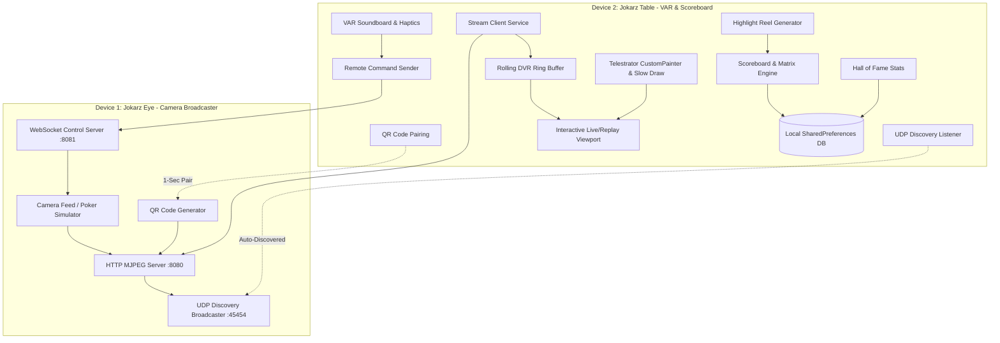

<div align="center">

[](https://github.com/Flexingg/CheetahCheaterCatcher/raw/main/releases/JokarzPlays-v1.0.2.apk)
[](https://github.com/Flexingg/CheetahCheaterCatcher/raw/main/releases/JokarzPlays-Windows-v1.0.2.zip)

[](https://flutter.dev)
[](https://dart.dev)
[](#)
[](LICENSE)
[](https://github.com/Flexingg/CheetahCheaterCatcher/releases/tag/v1.0.2)

### 📥 **[Download Android APK (v1.0.2)](https://github.com/Flexingg/CheetahCheaterCatcher/raw/main/releases/JokarzPlays-v1.0.2.apk)** | **[Download Windows App (v1.0.2 .zip)](https://github.com/Flexingg/CheetahCheaterCatcher/raw/main/releases/JokarzPlays-Windows-v1.0.2.zip)**

*The ultimate dual-mode Video Assistant Referee (VAR), instant replay DVR, telestrator drawing suite, quick-type matrix scoreboard, and lifetime trophy room for game nights, poker tables, card tournaments, and board game enthusiasts.*

</div>

---

## 📸 Overview & Modern Poker Night Aesthetic

Designed with a high-roller casino velvet theme: **Midnight Obsidian** (`#0D1117`), **Casino Felt Emerald** (`#00E676`), and **Luxury Vegas Gold** (`#FFB300`), specifically engineered for dim game rooms with zero eye fatigue.

```
       ┌─────────────────────────────────────────────────────────────┐
       │                   🃏  JOKARZ PLAYS  🃏                      │
       │           HIGH-ROLLER GAME NIGHT VAR & SCOREBOARD           │
       │                   ♠️    ♥️    ♦️    ♣️                      │
       └─────────────────────────────────────────────────────────────┘
                                      │
            ┌─────────────────────────┴─────────────────────────┐
            ▼                                                   ▼
┌───────────────────────┐                           ┌───────────────────────┐
│ 🎥 JOKARZ EYE         │                           │ 🃏 JOKARZ TABLE       │
│ (Camera Broadcaster)  │ ═════ Wi-Fi Stream ═════> │ (VAR & Scorekeeper)   │
│ • Local MJPEG Server  │       (<150ms lag)        │ • Live Video Canvas   │
│ • UDP Discovery       │ <════ Remote Sync ═══════ │ • DVR Instant Replay  │
│ • 1-Sec QR Pairing    │      (Torch/Sound/Zoom)   │ • Telestrator Markup  │
│ • Flashlight & Zoom   │                           │ • Quick-Type Scorepad │
└───────────────────────┘                           └───────────────────────┘
```

---

## 🌟 Core Features Built & Active

### 1. 🎥 Dual-Mode Device Role System (2-Fold Operation)
- **Device 1: Jokarz Eye (Camera Broadcaster)**:
  - Mount above the table or on a tripod.
  - Captures and streams live video directly over local Wi-Fi via a high-performance built-in HTTP MJPEG server (`:8080`) and WebSocket telemetry channel (`:8081`).
  - Auto-discovery beacon broadcasting on UDP `:45454`.
  - Accepts remote flashlight/torch toggles, digital zoom commands, camera flips, and synchronized referee alert alarms.
  - Built-in animated high-roller poker test pattern simulator for instant testing on emulators.
- **Device 2: Jokarz Table (Referee & Scorekeeper)**:
  - Connects instantly to any active Jokarz Eye on the local network.
  - Displays live video with FPS & telemetry badges.

### 2. ✨ Telestrator Animated "Slow Draw" Replay Stamp (#5)
- Record vector drawing strokes with relative timestamps.
- Tapping **"✨ Slow Draw / Animate Markup"** renders pen lines, arrows, and circles progressively onto the screen right over the controversy moment as if broadcast live on TV (like NFL / Premier League VAR broadcasts).

### 3. ⚡ 1-Second Instant QR Pairing (#9)
- Camera device displays a high-contrast luxury QR code (`jokarz://connect?ip=<ip>&streamPort=8080&controlPort=8081`).
- Controller pairs instantly in under 1 second with zero manual IP typing.

### 4. 🌲 Offline Wi-Fi Direct / Local Hotspot (0-Router) Mode (#10)
- Play outdoors, on planes, camping, or in cafes without a home Wi-Fi router.
- Automatically detects personal hotspot subnets (`192.168.43.x`, `172.20.10.x`, `192.168.137.x`).
- Includes an interactive step-by-step 0-Router guide.

### 5. 📼 VAR Instant Replay & Rolling DVR Scrubber
- Rolling in-memory ring buffer capturing up to 900 frames (~30 to 60 seconds).
- Instant freeze and rewind.
- Multi-speed slow-motion playback (`0.1x`, `0.25x`, `0.5x`, `1.0x`, `2.0x`).
- Precise single-frame advance (`< 1 frame`, `> 1 frame`).
- Interactive pinch-to-zoom and pan for close-up examination of card faces, dice rolls, and chip stacks.

### 6. ✏️ Telestrator Drawing Markup Suite
- Draw annotations directly on live or frozen replay frames.
- Tools: Freehand Pen, Arrow Indicator, Circle/Chip Marker, Straight Line, and Translucent Highlighter.
- High-contrast poker palette (Vegas Gold, Laser Crimson, Neon Emerald, Cyber Cyan, Pure White).
- Undo, Redo, Clear All, and Animated Slow Draw.

### 7. 🚨 Official VAR Whistle & Soundboard (#2)
- Interactive referee soundboard:
  - 🚨 **VAR Siren**: Heavy rhythmic siren & vibrating alert
  - ⚽ **Referee Whistle**: Sharp high-impact foul whistle
  - 📢 **Stadium Buzzer**: Deep buzzer haptic pulse
  - 🎰 **Casino Chips**: Fast micro-clicking haptics
  - 🔔 **Round Bell**: Clean metallic round bell
  - 👑 **Victory Fanfare**: Ascending chime celebration
- **Remote Table Alert**: Tapping soundboard buttons triggers synchronized alerts and flashes torch directly on the camera phone positioned above the game table!

### 8. ⌨️ Dual-Mode Scoring: Quick-Type Keypad + Chip Dial
- **Quick-Type Touch Keypad**: High-speed touch keypad (`[1-9, 0, +/-, ⌫]`) for fast numerical score entry with zero mobile keyboard glitches.
- **Casino Chip Dial**: One-tap poker chip point additions (`+1`, `+5`, `+10`, `+25`, `+50`, `+100`) and penalty deductions (`-1`, `-5`, `-10`, `-25`).
- **Dynamic Rules**: Support for *Highest Score Wins* (Poker, Catan, Scrabble, Spades) and *Lowest Score Wins* (Hearts, Golf, Uno, Dominoes).
- **Live Running Standings**: Automatic running total calculations, leader star indicators, and dynamic 👑 1st, 🥈 2nd, 🥉 3rd rank badges.

### 9. 🎬 Automated Match Highlight Reel & Controversy Recap (#6)
- Bookmark key moments, rule disputes, and controversial VAR reviews during the game.
- Generates a shareable WhatsApp / Discord / Messages summary card with final standings, MVP awards, and bookmarked controversies.

### 10. 🏆 Trophy Room & Career Hall of Fame
- Persistent lifetime records across all game nights:
  - 👑 Most Games Played Leaderboard
  - 🚀 Highest Single Round Score
  - 🛡️ Lowest Single Round Score
  - 🎯 Most Clean Sheets (0-score rounds)
  - 💎 Best Career Average Score per Round

---

## 📐 Architecture & Tech Stack

### System Diagram



### Tech Stack Breakdown
- **Frontend Framework**: Flutter 3.32+ / Dart 3.8+
- **State Management**: Provider (`ChangeNotifierProvider`)
- **Networking**:
  - Raw `HttpServer` multipart MJPEG streaming
  - Raw `WebSocket` bidirectional control channel
  - `RawDatagramSocket` UDP broadcast discovery
- **Persistence**: `shared_preferences` with JSON serialization
- **Rendering & Telestrator**: Flutter `CustomPainter`, `InteractiveViewer`, and `Matrix4` gesture transformations
- **QR Pairing**: `qr_flutter`

---

## 🚀 Getting Started & How to Use

### Prerequisites
- Flutter SDK `^3.32.1` or higher
- Android SDK (API 21+) / Xcode (iOS 13+)

### 1. Installation
```bash
git clone https://github.com/Flexingg/CheetahCheaterCatcher.git
cd CheetahCheaterCatcher/flutter_app
flutter pub get
```

### 2. Running on Device
```bash
# List connected devices
flutter devices

# Run on connected phone / tablet
flutter run
```

### 3. Playing a Game Night (Step-by-Step)
1. **Launch Jokarz Plays** on both devices connected to the same Wi-Fi (or one phone's Personal Hotspot).
2. On **Device 1**: Tap **"Jokarz Eye (Camera Streamer)"**.
   - Tap **"1-Sec QR Pair"** to display the pairing code.
3. On **Device 2**: Tap **"Jokarz Table (VAR & Controller)"**.
   - Tap **"Select Camera"** in the top bar; the camera will appear automatically. Tap **Connect**!
4. **During the Game**:
   - Need a referee check? Tap **"INSTANT REPLAY"** to scrub back, step frame-by-frame, and zoom into cards or dice.
   - Tap **"DRAW: ON"** to circle cards or draw arrows on screen. Tap **"✨ Slow Draw"** to animate your markup!
   - Tap **"VAR REFEREE SOUNDBOARD"** to trigger siren alerts or stadium buzzers on the table.
   - Switch to the **Scoreboard** tab to enter round scores with the **Quick-Type Keypad** or **Chip Dial**.
   - When finished, tap **"Declare Winner"** and generate your **Match Highlight Reel**!

---

## 💡 Flutter vs. Dart — What's the Difference?

- **Dart**: The object-oriented, type-safe **programming language** created by Google (analogous to TypeScript, Python, or C#). It provides fast asynchronous I/O, isolates, sound null safety, and ahead-of-time (AOT) compilation to machine code.
- **Flutter**: The cross-platform **UI framework and rendering engine** built with Dart. Flutter provides the reactive widget tree, Skia/Impeller hardware-accelerated canvas rendering, material theming, and multi-platform compilation.
- **The Result**: A **single codebase** written in Dart that compiles to native binary executables for **Android, iOS, Windows, macOS, Linux, and Web (Wasm/CanvasKit)**!

---

## 💻 Multi-Platform Build Instructions (Windows & Web)

### 1. 🪟 Windows Desktop Build
Run or compile native 64-bit Windows executable (`.exe`):
```bash
# Run locally on Windows Desktop
flutter run -d windows

# Build standalone Release bundle
flutter build windows --release
# Output: build/windows/x64/runner/Release/game_night_var.exe
```

### 2. 🌐 Web Build (HTML5 / WebAssembly / CanvasKit)
Deploy to any static web host, GitHub Pages, or local server:
```bash
# Run locally in Chrome / Edge
flutter run -d chrome

# Build optimized production web app
flutter build web --release
# Output: build/web/
```

### 3. 📱 Mobile Builds (Android & iOS)
```bash
# Android APK
flutter build apk --release

# Android App Bundle (Google Play)
flutter build appbundle --release

# iOS App Bundle (Xcode / TestFlight)
flutter build ipa --release
```

---

## 🔮 50 Future Feature Ideas

### 🤖 Computer Vision & AI (Ideas 1–10)
1. **AI Card & Poker Hand Evaluator**: Real-time camera detection of community cards and player hole cards with win probability percentage overlays.
2. **AI Dice Pip Counter**: Point camera at thrown dice in Catan, Craps, or Yahtzee to instantly tally and log the roll in the scoreboard without manual input.
3. **Automated Sleight-of-Hand Anomaly Detector**: Lightweight computer vision flagging unnatural hand movements over the deck or chip tray.
4. **Tile & Board State OCR**: Snap board state in Scrabble or Codenames to verify word validity and letter multipliers against official tournament dictionaries.
5. **Scorecard Handwriting Digitizer**: Point the camera at a paper scorecard to OCR and import historical scores into the app automatically.
6. **Chip Stack Volumetric Estimator**: CV model calculating player chip stack totals from an angled snapshot without counting individual chips.
7. **Domino Pips & Bone Counter**: Automatic detection of domino bones and open ends on the table.
8. **Card Count & Burn Pile Tracker**: Automatic detection of cards played to track card count and remaining deck probabilities in Blackjack/Spades.
9. **Catan Longest Road & Largest Army Auto-Detector**: Visual table parser verifying longest continuous road connections.
10. **Cheat Detection Heatmap**: Highlight players with frequent out-of-turn touches or suspicious chip handling.

### 🎥 Multi-Angle & Broadcast (Ideas 11–20)
11. **Multi-Camera Split-Screen (Quad-View)**: Connect up to 4 camera phones simultaneously (Overhead Table + Player 1 Hand + Player 2 Hand + Pot Cam).
12. **Picture-in-Picture (PiP) Floating Referee View**: Keep a floating mini-VAR window on screen while typing scores into the matrix table.
13. **Chroma-Key Virtual Felt Customizer**: Replace physical table felt with custom digital casino felt textures (High-Roller Velvet, Cyberpunk Neon, Classic Emerald).
14. **Automated PTZ Pan & Track**: Software-based digital tracking that auto-crops and zooms in on active player hands during card dealing.
15. **4K Lossless Snapshot Archive**: Capture full-resolution raw snapshots on the camera phone during controversial plays for forensic zoom.
16. **Broadcast Graphics Score Bug Overlay**: Broadcast-style TV lower third graphic showing live player totals and leader shifts.
17. **Side-by-Side Synchronized Multi-Angle Replay**: Scrub two synchronized camera angles simultaneously on the same timeline.
18. **Drone & Overhead Gimbal Support**: RTSP / RTMP input support for overhead wireless gimbals and action cams.
19. **Smart Lighting Hub Integration**: Sync Philips Hue / Nanoleaf room lights to flash red during VAR reviews and pulse gold on victory.
20. **Live Web Spectator Stream (LAN Web Portal)**: Built-in local web portal allowing spectators in the room to watch the feed from any web browser via Wi-Fi.

### ⏱️ Tournament & Gameplay Timers (Ideas 21–30)
21. **Tournament Chess Clock & Dynamic Turn Timers**: Configurable countdown per player per turn with blitz increment and red-warning screen flashes.
22. **Blind Level Manager with Audio Alerts**: Automated Texas Hold'em blind level scheduler (Small/Big Blind countdowns, ante bumps, and break alarms).
23. **Analysis Paralysis Penalty Alarm**: Automatically plays a buzzer and deducts chips when a player takes longer than the allocated shot clock.
24. **Dealer & Button Rotation Tracker**: Visual marker tracking who has the dealer button, big blind, and active turn around the table.
25. **Voice-Activated Hands-Free Referee ("Hey Jokarz")**: Voice command parser (*"Jokarz, add 15 points to Alice"*, *"VAR Check"*) for 100% hands-free scoring.
26. **Tournament Bracket Generator**: Single & double elimination bracket manager with auto-advancing winners.
27. **Seating Chart & Chip Rebalancing Randomizer**: Randomize player table seatings and chip denominations with 1 tap.
28. **Side Pot Calculator & Split Pot Solver**: Automated side pot arithmetic for all-in poker showdowns with multiple callers.
29. **Time-Bank Cards & Token Manager**: Players can spend "Time-Bank Chips" to get 30 extra seconds on critical decisions.
30. **Haptic Smartwatch Ref Buzz**: Send silent haptic buzzes to Apple Watch / WearOS when a turn timer is expiring.

### 🎨 AR & Telestrator Upgrades (Ideas 31–40)
31. **AR Tabletop Range Ruler**: Augmented reality measuring tape measuring millimeter distances on table for miniature wargaming line-of-sight.
32. **Custom Stamp Library**: Drop-in telestrator stamps (e.g. 🃏 JOKER, ❌ FOUL, 👑 MVP, ⚠️ WARNING, 🔍 ZOOM, 💣 BLUNDER).
33. **Laser Pointer Mode**: Real-time laser pointer dot synced across devices for interactive rule debates.
34. **3D Card Heatmap**: Visual overlay highlighting table zones with the most card action and chip transactions.
35. **Measurement Arc & Angle Protractor**: Draw degree angles and trajectory arcs over game boards (e.g., Crokinole, Carrom, Billiards).
36. **Magnifying Loupe Tool**: Circular draggable magnifying lens with 10x digital enhancement.
37. **Player Spotlight Beam**: Darken the entire table except for a circular spotlight over the active player's hand.
38. **Ghost Trail Motion Tracker**: Draw ghost lines showing the movement path of a moved token or card.
39. **Multi-User Collaborative Telestration**: Multiple players draw simultaneously from their own devices during rule disputes.
40. **Chalkboard Grid Overlay**: Toggle square, isometric, or hex grid lines projected over physical board games.

### 🏆 Social, Esports & Stats (Ideas 41–50)
41. **MP4 Video Clip Exporter with Watermark**: Export 10-second video clips of controversial calls with telestrator drawings baked directly into the video.
42. **NFC & RFID Chip / Card Integration**: Tap NFC-tagged player chips or deck cards for automated chip count tracking.
43. **Player Head-to-Head Rivalry Tracker**: Deep rivalry analytics (Alice vs Bob win rate, biggest upsets, longest winning streaks).
44. **Cloud Sync & Discord Bot Integration**: Post automated match recaps, box scores, and Hall of Fame leaderboards directly to a Discord server webhook.
45. **Custom Player Avatars & Sound Cues**: Custom victory walkout songs and avatar portraits for each player.
46. **Fantasy Game Night League**: Draft players across weekly game night seasons with fantasy points based on rankings and clean sheets.
47. **Trophy Room 3D Showcase**: Interactive 3D rendered trophy cabinet displaying earned virtual rings and gold bracelets.
48. **PDF Official Scoresheet Export**: Export print-ready high-resolution tournament scoresheet PDF documents.
49. **Bad Beats & Epic Comeback Badges**: Unlock achievement badges (e.g., "The Phoenix" for coming back from last place, "Cardiac Kid").
50. **Twitch & YouTube Live Stream Overlay Kit**: Transparent WebRTC / OBS browser source overlay streaming scoreboard and VAR replays directly to Twitch/YouTube.

---

## 📄 License
This project is open-source under the [MIT License](LICENSE). Built for the ultimate game night experience!
